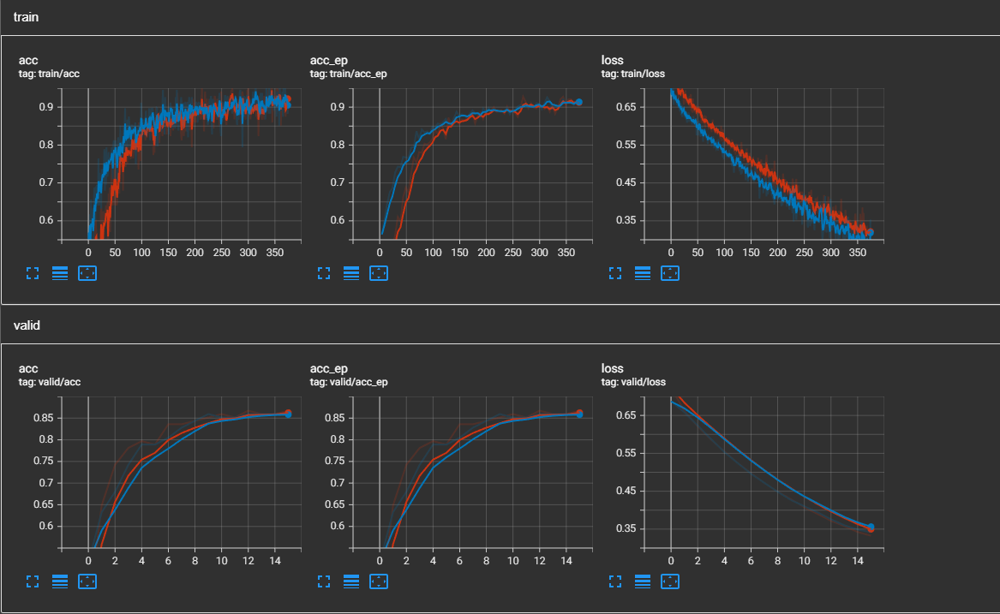

# check

**Установка библиотек:**

```angular2html
conda install pytorch torchvision torchaudio pytorch-cuda=11.6 -c pytorch -c nvidia albumentations pillow tensorboard
```

Схема расположения данных в директориях:

├── dataset


|   ├── train / valid / test (3 directories) 


|   |   ├── check


|   |   └── negatives

В папке `executors` находятся файлы запуска. 

`classify` - пайплайн обучения модели.

`trainer` - пайплайн обучения модели.

`test` - запустить только на тестовых данных.

`take_augmentation_image.py` - сохраняет аугментированные данные в `executors/im`

**Если запуск с linux:**

В папке `datasets` в файле `dataset.py` изменить в классе `ImageLoader` в функции `__getitem__` `\\` на `/`

В папке `exeutors` в самом конце, при загрузке весов модели изменить `\\` на `/`

**Графики обучения на 75 эпохах с weight decay и без.**


